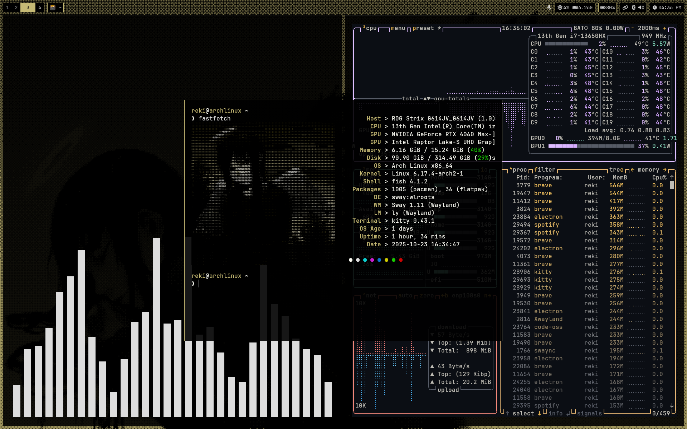

## Dotfiles



### Arch installation

I wrote a full and detailed guide on how I install and set up Arch Linux from scratch, including partitioning, base system installation, and configuring my environment, check out the [detailed guide](https://dub.sh/arch-linux-install).

### Dual booting

If you have interest in dual booting with Windows, I maintain a [separate repository](https://github.com/lpndev/wpis) that covers everything step-by-step like optimize it, and remove bloatware for a clean and efficient system.

### Import VSCode extensions

```shell
code --list-extensions > "~/.config/Code - OSS/extensions.txt"
```

### Contribute

Feel free to contribute improvements or suggest changes by submitting [issues](https://github.com/lpndev/dotfiles/issues) or [pull requests](https://github.com/lpndev/dotfiles/pulls).
